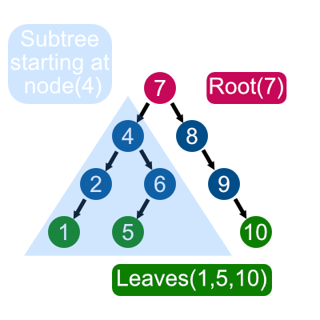
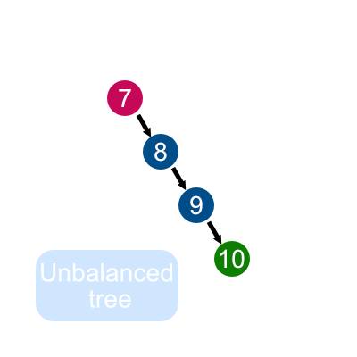
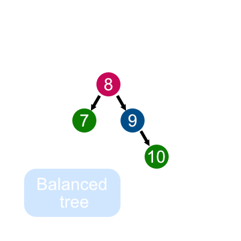

# Binary Tree

| [README](../README.md) | [Queue](queue.md) | [Set](set.md) | [Binary Tree](binaryTree.md) |
| ---------------------- | ----------------- | ------------- | ---------------------------- |

## Introduction

In computer science, a binary tree is a tree data structure in which each node has at most two children, which are referred to as the left child and the right child.

The root node is the top most node of your binary tree there can only be one root node per tree.

At the very bottom of your tree you have your leaf nodes. These are your bottom most nodes, you can have more than one leaf. These can be called the leaves of your binary tree.

A Subtree is a smaller section of a binary tree. In your original tree pick a new node to be your root node for this binary subtree.



A binary tree has a big O of O(log n) this is what makes the binary tree so usefull.



This tree is a BST but looks more like a linked list. This BST is unbalanced has a resulting performance for searching of O(n) instead of O(log n).



## Insert

The insert function will insert 'data' into the BST. If the BST is empty, then set the root equal to the new node. Otherwise, use \_insert to recursively find the location to insert.

The \_insert function will look for a place to insert a node with 'data' inside of it. The current subtree is represented by 'node'. This function is intended to be called the first time by the insert function.

```python
def insert(self, data):
	if self.root is None:
		self.root = BST.Node(data)
	else:
		self._insert(data, self.root)  # Start at the root

def _insert(self, data, node):
	if data < node.data:
		# The data belongs on the left side.
		if node.left is None:
			# We found an empty spot
			node.left = BST.Node(data)
		else:
			# Need to keep looking.  Call _insert
			# recursively on the left subtree.
			self._insert(data, node.left)
	elif data >= node.data:
		# The data belongs on the right side.
		if node.right is None:
			# We found an empty spot
			node.right = BST.Node(data)
		else:
			# Need to keep looking.  Call _insert
			# recursively on the right subtree.
			self._insert(data, node.right)
```

## Contains

The \_\_contains\_\_ function will check to see if data is in the BST tree. when done like this the 'in' keyword is supported.

The \_contains function will search for a node that contains 'data'. This function is intended
to be called the first time by the \_\_contains\_\_ function.

```python
def __contains__(self, data):
        """
        if 5 in my_bst:
            ("5 is in the bst")
        """
        return self._contains(data, self.root)  # Start at the root

def _contains(self, data, node):
    if node is not None:
        if data < node.data:
            return self._contains(data, node.left)
        elif data > node.data:
            return self._contains(data, node.right)
        elif data == node.data:
            return True
    else:
        return False
```

## Traverse Forward

When traversing forward you are doing an in order traversal starting from the root of the BST. This is called a generator function.

If the node that we are given which is the current subtree exists, then we will keep traversing on the left side checking for the smaller numbers first, then we will provide the data in the current node, and finally we will traverse on the right side checking for the larger numbers last.

```python
def __iter__(self):
	"""
    This function is called when a loop	is performed:

	for value in my_bst:
		print(value)
	"""
	yield from self._traverse_forward(self.root)  # Start at the root

def _traverse_forward(self, node):
	"""
	This function is intended to be called the first time by
	the __iter__ function.
	"""
	if node is not None:
		yield from self._traverse_forward(node.left)
		yield node.data
		yield from self._traverse_forward(node.right)
```

## Example

```python
print("Example")

```

## Problem to Solve

[Binary Tree start](../practice_problems/binaryTree_start.py)

Once you solve the problem check the solution to compare your answer.

[Binary Tree solution](../practice_problems/binaryTree_solution.py)
