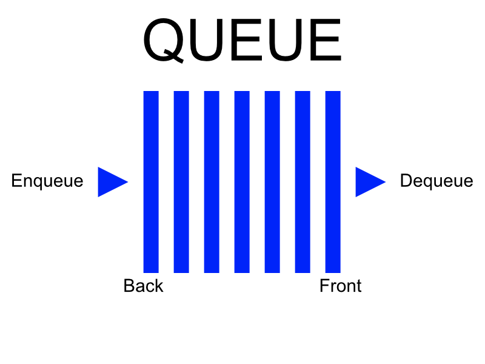

# Queue

| [README](README.md) | [Queue](queue.md) | [Set](set.md) | [Binary Tree](binaryTree.md) |
| ------------------- | ----------------- | ------------- | ---------------------------- |

## Introduction

Queues are used when data needs to be processed in a First In First Out (FIFO) order. This makes queuevery useful in these kind of scenarios.

1. When a resource is shared amoung multiple users. ex CPU scheduling, Disk Scheduling.
2. When data is transfered asynchronously between two processes. ex IO Buffers, pipes, file IO.



Let us think of this queue above as a line waiting to go into the movie theater.

## Enqueue

You don't cut in line in the movie theater you have to enter in from the back. This is what we would call in relation to a queue an _enqueue_.

The Big-O notation for _enqueue_ is O(1) - Performance of adding to the end of the dynamic array.

How to implement in Python

```python
my_queue.append(value)
```

## Dequeue

As you wait in line people will purchase their tickets and leave from the front of the line. This is what we would call in relation to a queue a _dequeue_.

The Big-O notation for _dequeue_ is O(n) - Performance of obtaining and removing from the beginning of the dynamic array.

How to implement in Python

```python
value = my_queue.pop(0)
```

## Example

```python
print("Example")
movie_line = Queue()

# adds three people to our movie line
movie_line.enqueue("Bob")
movie_line.enqueue("Amanda")
movie_line.enqueue("Gerald")

# removes the front most person from our movie line
person = movie_line.dequeue()
print(person) # Bob
person = movie_line.dequeue()
print(person) # Amanda
person = movie_line.dequeue()
print(person) # Gerald
```

## Problem to Solve

You will be working on getting the skip, +2, and +4 uno card to work.
[Uno](queue_start.py)

Once you solve the problem check the solution to compare your answer.
